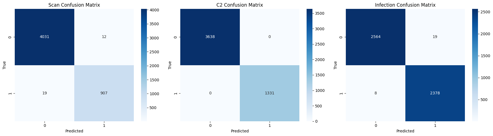

# Adaptive-IOT-Botnet-Detection
Implementation of a Modular Neural Network for Edge-Based IoT Security with Adaptive Retraining.
# Adaptive Modular Neural Network for Edge-Based IoT Security
**Author:** Suhrud Sharma  
**Project Type:** Research Implementation  
**Dataset:** N-BaIoT (NetLab)  
**Models:** Scan Detection | C2 Command Detection | Malware Infection Detection  
**Deployment Target:** Edge IoT Devices (TensorFlow Lite Models)

---

## 1. Introduction
This repository contains the complete implementation of an adaptive modular neural network designed for real-time IoT security.  
The system follows a modular intrusion detection architecture and is optimized for lightweight edge deployment using TensorFlow Lite.

IoT devices generate high-volume, continuous network traffic, making traditional monolithic intrusion detection systems less effective.  
This project introduces a modular approach where individual models independently detect scanning behavior, command-and-control (C2) communication, and malware infection activity.

---

## 2. Project Objectives
- Develop a modular neural network architecture for IoT intrusion detection.  
- Perform per-window feature aggregation from raw network traffic.  
- Train independent neural models for:
  - Scan traffic detection  
  - C2 command detection  
  - Malware infection detection  
- Enable adaptive retraining for long-term improvement.  
- Convert trained models into TensorFlow Lite format for edge deployment.  
- Evaluate the models using confusion matrices, classification reports, and accuracy metrics.

---

## 3. Dataset
This project uses the N-BaIoT dataset, which includes benign traffic and attack samples generated by Mirai and Gafgyt botnet families.

Files used include:
- 1.benign.csv  
- 1.mirai.scan.csv  
- 1.mirai.syn.csv  
- 1.mirai.udp.csv  
- 1.gafgyt.scan.csv  
- 1.gafgyt.tcp.csv  
- 1.gafgyt.udp.csv  

Each file was labeled and merged into a unified dataset for model training.

---

## 4. System Architecture

### 4.1 Data Preprocessing
- Load N-BaIoT CSV files  
- Normalize column names  
- Add metadata such as timestamps, IPs, ports, flags  
- Map each input record to:
  - Scan  
  - C2  
  - Infection  
  - Benign  

### 4.2 Feature Engineering
Window-based traffic aggregation (3-second windows) is used to compute:
- Packet rate  
- Byte volume  
- Mean packet size  
- Destination IP count  
- Port diversity  
- Failed connection ratio  
- Flow duration statistics  
- Inter-arrival time variance  
- Maximum flows to the same destination  

### 4.3 Modular Neural Network
Three separate models are trained:
- Scan Detection Model  
- C2 Detection Model  
- Infection Detection Model  

Each model is trained independently and evaluated on separate labels.

### 4.4 Edge Deployment
TensorFlow Lite (TFLite) conversion is used to create lightweight models:
- scan_model.tflite  
- c2_model.tflite  
- inf_model.tflite  
- c2_model_adapted.tflite  

These models are suitable for microcontrollers and resource-constrained IoT devices.

---

## 5. Adaptive Retraining
Adaptive retraining allows the system to update itself with new traffic behavior.

Process:
1. Collect real-time window samples  
2. Merge with original training data  
3. Retrain the affected module (e.g., C2 model)  
4. Export updated TFLite model  

This improves long-term robustness in dynamic IoT environments.

---

## 6. Evaluation

The models are evaluated using:
- Confusion matrices  
- Accuracy  
- Precision, Recall  
- F1-score  

### Final Confusion Matrix
Below is the combined confusion matrix image included in the repository:



---

## 7. Repository Structure

```text
.
├── RP1.ipynb
├── scan_model.tflite
├── c2_model.tflite
├── inf_model.tflite
├── c2_model_adapted.tflite
├── ConfusionMatrixCombined.png
└── README.md
````
---

## 8. Requirements
- Python 3.x  
- TensorFlow / Keras  
- NumPy  
- Pandas  
- Scikit-Learn  
- Matplotlib  
- Seaborn  

All dependencies can be installed in a Google Colab environment.

---

## 9. How to Run

1. Open the notebook **RP1.ipynb**  
2. Run each section in order:
   - Load dataset  
   - Preprocess data  
   - Extract window-based features  
   - Train modular neural networks  
   - Evaluate modules  
   - Run adaptive retraining  
   - Export TFLite models  
   - Execute final modular decision system  
3. Outputs include:
   - Three trained neural models  
   - TFLite edge models  
   - Confusion matrices  
   - Final decisions on test samples  

---

## 10. Conclusion
This project demonstrates a deployable modular neural network architecture for IoT security.  
By isolating scanning, C2, and infection behaviors into independent models, the system achieves high accuracy and efficiency suitable for real-time edge deployment.

Adaptive retraining enhances long-term resilience against evolving threats, making this approach well suited for practical IoT environments.

